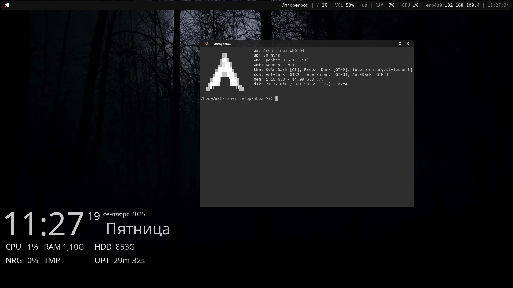

# hi there!
this is my first attempts at ricing. i've got this. maybe that looks bad and far from rice, but i like it
## akhtung!
**this needs patchs on your computer. some things may be unstable. this was tested on HP 250 G6 and main author's PC**
## installation
### manual
you need:
* base: [openbox](https://archlinux.org/packages/extra/x86_64/openbox/)
* bar: [polybar](https://archlinux.org/packages/extra/x86_64/polybar)
* screenshoter: [flameshot](https://archlinux.org/packages/extra/x86_64/flameshot)
* notification manager: [dunst](https://archlinux.org/packages/extra/x86_64/dunst)
* locker: [i3lock-color](https://aur.archlinux.org/packages/i3lock-color)<sup>AUR</sup> [scrot](https://archlinux.org/packages/extra/x86_64/scrot) [imagemagick](https://archlinux.org/packages/extra/x86_64/imagemagick)
* terminal: [alacritty](https://archlinux.org/packages/extra/x86_64/alacritty) [fish](https://archlinux.org/packages/extra/x86_64/fish) [fastfetch](https://archlinux.org/packages/extra/x86_64/fastfetch) [chafa](https://archlinux.org/packages/extra/x86_64/chafa)
* runner: [rofi](https://archlinux.org/packages/extra/x86_64/rofi)
* app themes: [kvantum](https://archlinux.org/packages/extra/x86_64/kvantum) [kvantum-qt5](https://archlinux.org/packages/extra/x86_64/kvantum-qt5) [qt5ct](https://archlinux.org/packages/extra/x86_64/qt5ct) [qt6ct](https://archlinux.org/packages/extra/x86_64/qt6ct) [gtk-theme-elementary](https://archlinux.org/packages/extra/x86_64/gtk-theme-elementary) [elementary-icon-theme](https://archlinux.org/packages/extra/x86_64/elementary-icon-theme)
* desktop: [conky](https://archlinux.org/packages/extra/x86_64/conky) [feh](https://archlinux.org/packages/extra/x86_64/feh)
* extra: [picom](https://archlinux.org/packages/extra/x86_64/picom)
for arch linux we can use this command:
```shell
sudo pacman -S --needed openbox polybar flameshot dunst scrot imagemagick alacritty fish fastfetch chafa rofi kvantum kvantum-qt5 qt5ct qt6ct elementary-icon-theme conky feh picom
```
and install <sup>AUR</sup> packages:
#### yay
```shell
yay -S i3lock-color
```
#### paru
```shell
paru -S i3lock-color
```
#### universal
```shell
sudo pacman -S --needed base-devel git
git clone https://aur.archlinux.org/i3lock-color.git
cd i3lock-color
makepkg -si
```
now we should clone repo and copy all dotfiles:
```
git clone https://github.com/msh356/openbox-rice
cp -r openbox-rice/openbox/. ~/
```
### automatical
enter this:
```
sudo pacman -S --needed --noconfirm openbox polybar flameshot dunst scrot imagemagick alacritty fish fastfetch chafa rofi kvantum kvantum-qt5 qt5ct qt6ct elementary-icon-theme conky feh picom base-devel git
git clone https://aur.archlinux.org/i3lock-color.git
cd i3lock-color
makepkg -si
git clone https://github.com/msh356/openbox-rice
cp -r openbox-rice/openbox/. ~/
clear && echo "Cool! Now select Openbox in your Display Manager."
```